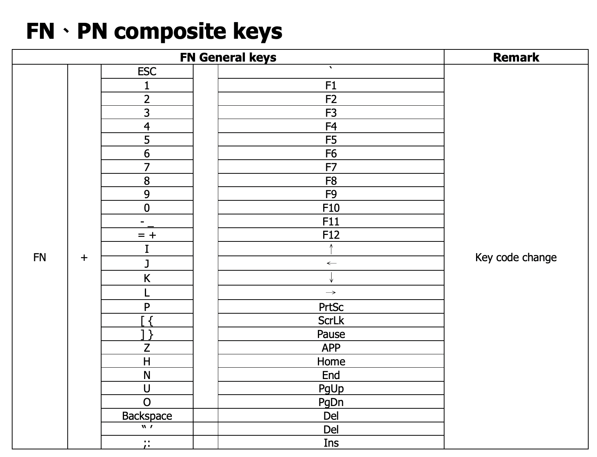
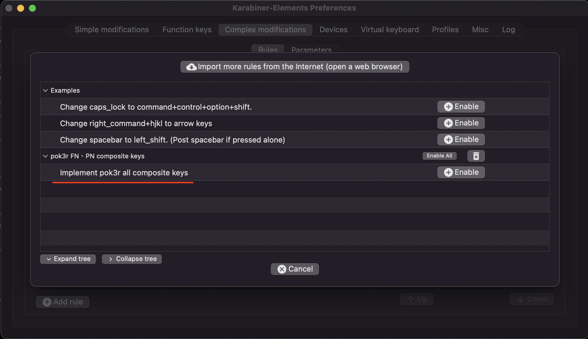

# Karabiner-generator
透過腳本自動產生 Karabiner 的設定檔。

# 目的
由於 60 % 鍵盤的一些組合鍵太方便了，當使用筆電鍵盤的時候非常不習慣，常常會按錯。
我之前使用 POK3R 的 60% 鍵盤，非常好用，平常使用的筆電又是 MacOS，所以嘗試使用 Karabiner 建構 POK3R 的組合鍵。

## Karabiner
Karabiner 是一個 MacOS 平台的應用程式，它可以對鍵盤做一些客製化的設定。
[Karabiner official web site](https://karabiner-elements.pqrs.org/)

## POK3R
POK3R 的組合鍵我常用的也只有一小部分



Reference: [Pok3r official manual](http://www.vortexgear.tw/db/upload/webdata4/6vortex_20166523361966663.pdf)

### Translate to Karabiner key code

```txt
fn + escape = grave_accent_and_tilde
fn + 1 = f1
fn + 2 = f2
fn + 3 = f3
fn + 4 = f4
fn + 5 = f5
fn + 6 = f6
fn + 7 = f7
fn + 8 = f8
fn + 9 = f9
fn + 0 = f10
fn + hyphen = f11
fn + equal_sign = f12
fn + i = up_arrow
fn + j = left_arrow
fn + k = down_arrow
fn + l = right_arrow
fn + p = print_screen
fn + open_bracket = scroll_lock
fn + close_bracket = pause
# fn + z = APP (I don't know what is APP)
fn + h = home
fn + n = end
fn + u = page_up
fn + o = page_down
fn + delete_or_backspace = delete_forward
fn + quote = delete_forward
fn + semicolon = insert
```

### 定義 fn key 為 caps_lock
我偏好使用 caps_lock 鍵，作為控制組合鍵的功能鍵。
當按下 caps_lock 的時候設定一個變數，用來判斷是否啟動組合鍵。
```
caps_lock down => caps_lock_pressed = 1
caps_lock up => caps_lock_pressed = 0
```

## Install and Enable
執行腳本會透過 STDOUT 輸出這個設定檔的 json 字串，將 json 存到 Karabiner 設定檔目錄底下。
```bash
./karabiner_pok3r.py | jq > pok3r.json
cp pok3r.json ~/.config/karabiner/assets/complex_modifications
```

開啟 Karabiner-Elements 將 rule enable.


